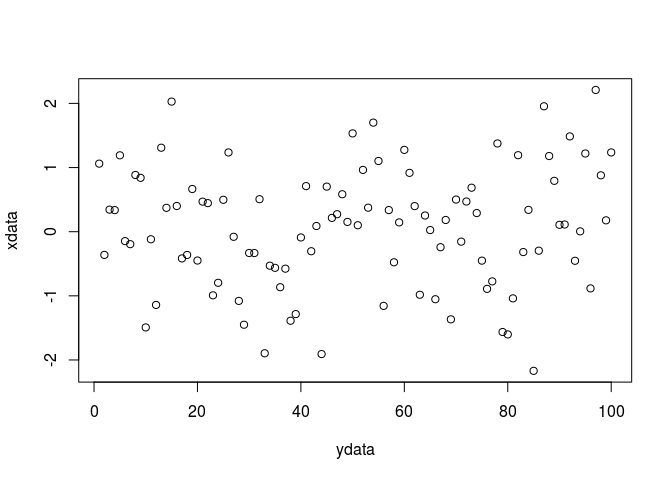

R Markdown first test
================
It's today!! duhhhh

R Markdown
----------

This is an R Markdown document. Markdown is a simple formatting syntax for authoring HTML, PDF, and MS Word documents. For more details on using R Markdown see <http://rmarkdown.rstudio.com>.

When you click the **Knit** button a document will be generated that includes both content as well as the output of any embedded R code chunks within the document. You can embed an R code chunk like this:

``` r
ydata <- 1:100
xdata <- rnorm(length(ydata))
plot(ydata, xdata)
```



``` r
summary(xdata)
```

    ##     Min.  1st Qu.   Median     Mean  3rd Qu.     Max. 
    ## -2.17000 -0.49050  0.12850  0.05788  0.68990  2.21000
